1. 汇编代码与特定机器息息相关
2. 编译时优化
    - gcc/cc -Og -o exe 1.c 2.c //低级优化
    - -O1 -O2 //高级优化
3. 计算机系统中最重要的两种抽象
    1. 指令集架构
    2. 虚拟内存
4. 常用寄存器
    1. PC, x86-64中是%rip
    2. 16个整数寄存器
    3. 条件码寄存器
5. 汇编，目标文件
    - gcc -Og -S 1.c //生成.s
    - gcc -Og -c 2.c //生成.c
6. 反汇编(从.o反汇编成.s)
    - objdump -d 1.o
7. 当编译多个文件，且文件有关联时，就需要链接器来处理（变换地址）
8. 汇编默认格式时ATT，以下切换成intel
    - gcc -Og -S -masm=intel mstore.c
    - 在intel和microsoft的文档中出现
9. 汇编代码后缀
    - 原理：16位word，32位double, 64位quad
    - 整数，指针：b, w, l, q
    - 浮点: s, l
10. 浮点数和整数使用的是一组完全不同的指令和寄存器
11. 16个整数寄存器  
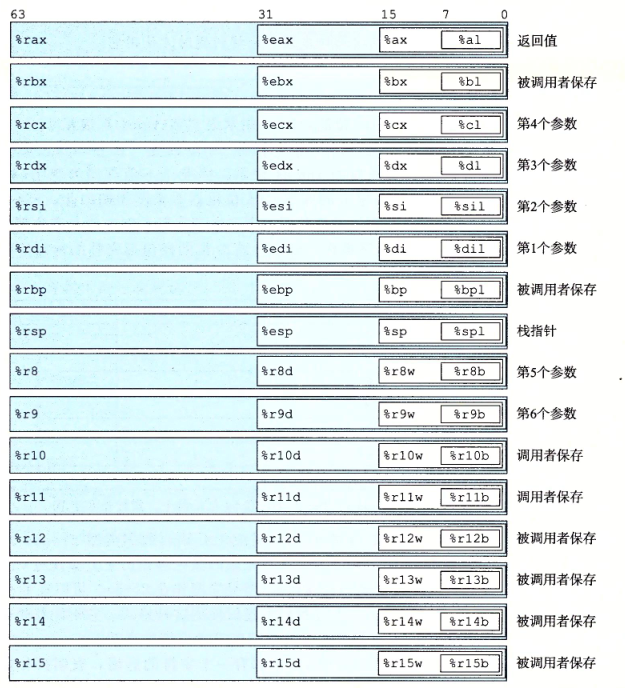
12. 对于生成1，2，4字节的规则
    - 生成1，2字节，其余不变
    - 生成4字节，高位变为0
13. 寻址方式  
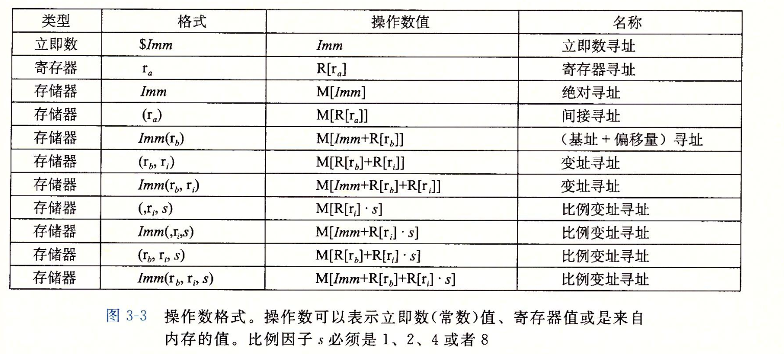
14. 数据传送指令  
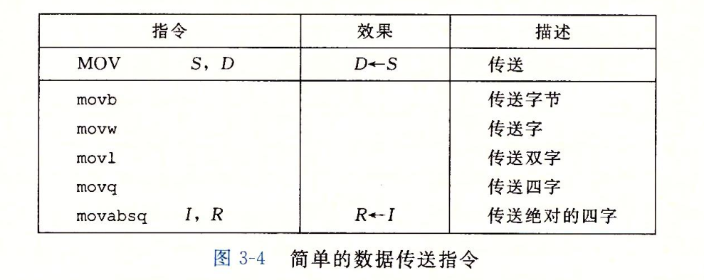
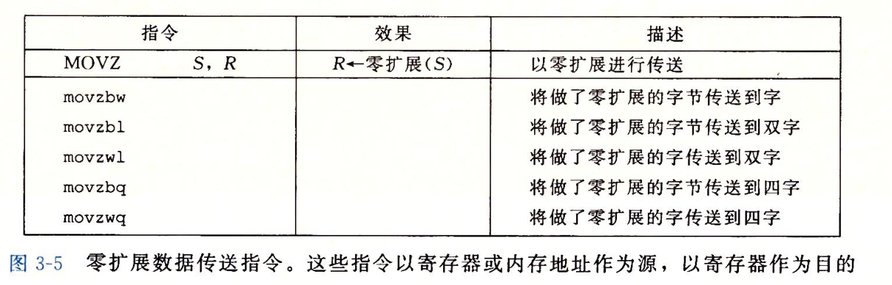
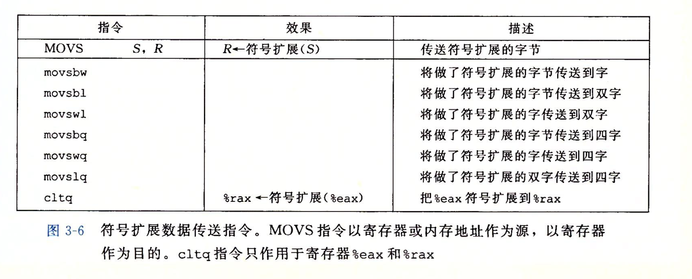
15. 上面三个图的注意点
    1. 图1的S和D可以为立即数，寄存器，内存，但不能都为内存。注意这里只要是有S和D，就不能都为内存，下面的add，sub都是这样。
    2. movabsq
        - 针对立即数。源为立即数，目的为寄存器。常规的movq只能以32位补码为立即数，然后符号扩展。而movabsq可以以64位补码为立即数。
    3. 图2中没有movzlq
        - 因为x86-64的隐藏规则，所以该功能可以被movl替代，详见本页12
    4. 图2和图3无法使用立即数
16. 栈指令 
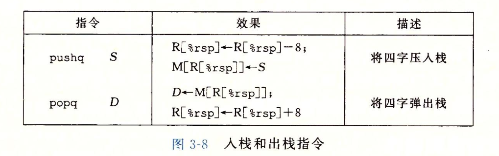
17. 上图说明
    - 栈主要用在函数调用，用来存放地址。一个地址64位，也就是8个字节，所以会出现“8”。
    - 栈的栈顶在较低的地址。
18. 算数和逻辑指令 
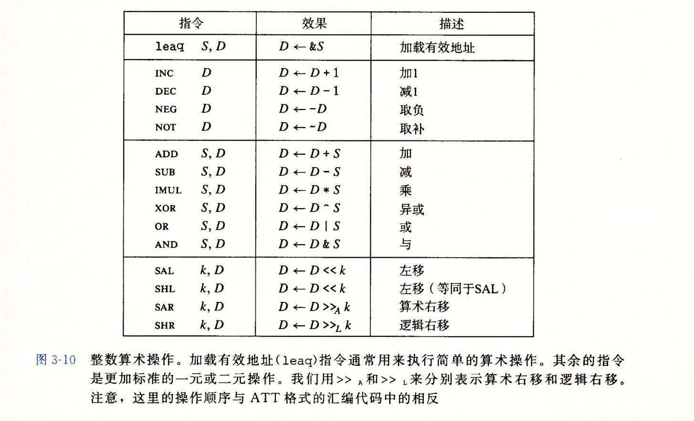
19. 对上图的解释
    1. movq 是将M[S]放到D，而leaq是直接将地址放到D
    2. 移位，shift，可以直接使用立即数，也可以将k放入%cl中。
    3. 假如SALB，由于B有8位，$2^3=8$，则只需要看%cl的后三位，其他同理，所以%cl足够了
    4. 立即数：salq $4, %rax
    5. cl : salq %cl, %rax
20. 特殊的算术指令 
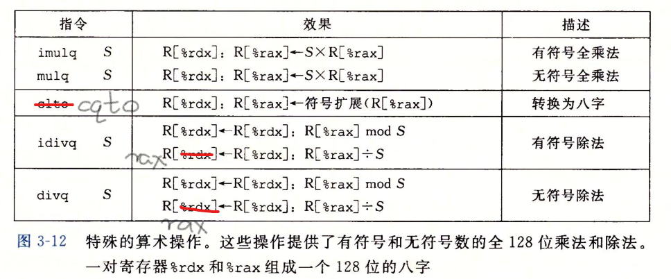
21. 上图原则
    - 结果放入rax，rdx放入附加内容
    - 一般情况下，cqto和除法指令是配套使用的，先用cqto，再除法
    - cqto是有符号扩展，若要无符号扩展，使用movl $0, %edx
22. CF, OF, SF, ZF
    - SF,sign,结果最高位为1，则SF为1
    - ZF,zero,结果为0，则ZF为1
    - CF,carry,相加后，进位存到CF；相减，若有借位，CF也变为1。用来判断无符号加减是否溢出。
    - OF,overflow，若两数符号相同，结果符号相反，则OF为1。用来判断有符号加减是否溢出。
23. 注意事项
    - leaq不改变标志位
    - xor CF，OF都为0
    - 移位，CF会是最后一个被移出的位，溢出设为0
    - INC,DEC会改变溢出和零标志，但不改变CF
24. CMP和test 
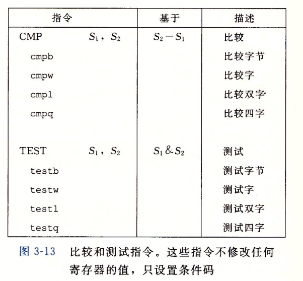
25. 注意事项
    - test的经典用法就是test %rax, %rax，测试是0，负数，还是整数.
    - 注意S2是主体
26. SET指令，注意great，less，above，below，set只针对一个字节，可以是寄存器，也可以是内存 
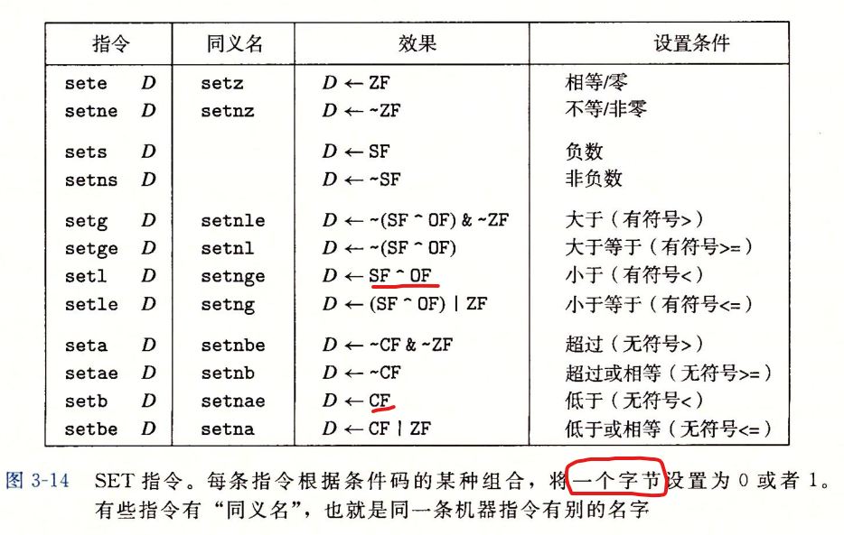
27. set的解释,分别讨论有溢出情况下的小于和无溢出情况下的小于 
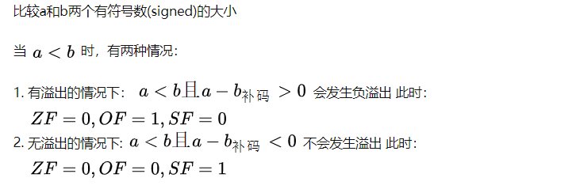
28. jmp指令
    - jmp 指令指示了一个label，在汇编阶段，也就是生成目标文件的阶段，汇编器会将label编码为具体的地址
29. jmp指令 
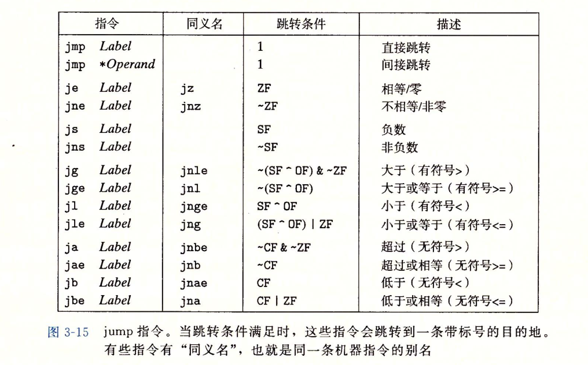
30. 汇编产生的目标文件和链接后的机器指令例子 
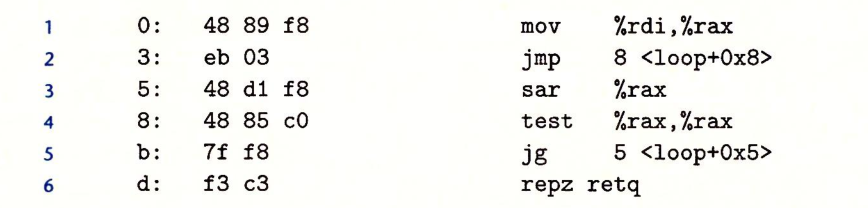
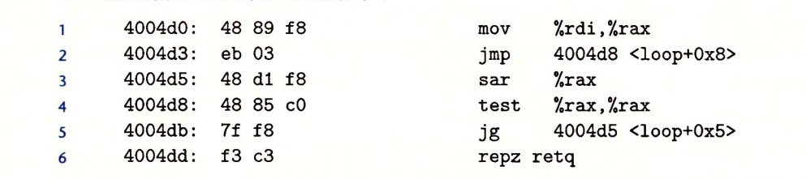
31. 上图解释
    - 第2行跳转指令运行过程：%rip先由3加到5(PC = PC + 1),然后注意到03，所以%rip = 5 + 3 = 8，最后跳到8
    - 链接后地址会发生改变