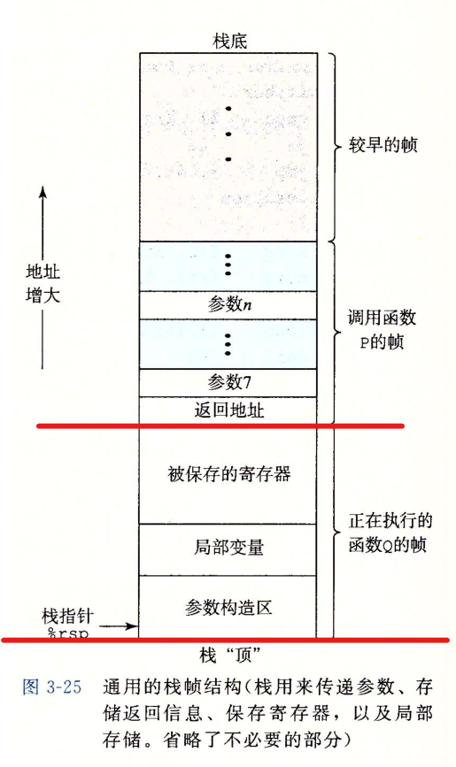

## 过程
-------
#### 栈帧

- 栈帧（最下面应该有一个返回地址）
- 被保存的寄存器
    - 若是要使用callee register（被调用者保存寄存器），就需要先push，过程调用返回前要pop
    - rbx, rbp, r12 ~ r15
- 局部变量
  - 出现条件
    1. 寄存器不够放
    2. 要取地址（&）
    3. 数组或者结构
  - 最好画出栈帧
- 参数构造区
  - 下一个过程调用的参数7 ~ 参数n
  - 参数1~6：rdi, rsi, rdx, rcx, r8, r9
  - 例子：需要传入小的时，使用r9b
--------
#### 转移控制call
- rsp，rsp内容的变化
-------
#### 递归
- 其实没太大区别
------
#### 补充
- 假如出现rsp-8却不保存东西时，不必惊慌，因为ISA规定的要对齐16字节，可以加快效率
- https://www.zhihu.com/question/528920145/answer/2447783037
