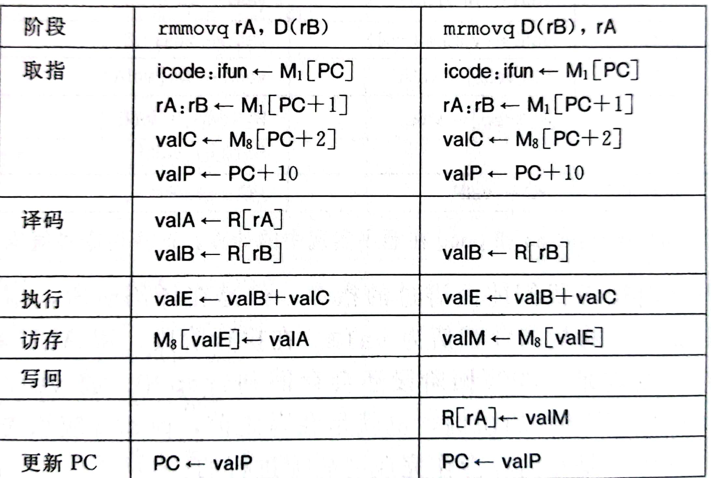

## 概述
1. 书上没写这玩意叫微操作，为了简便起见，称其微操作
2. 执行一条指令，需要多个操作，称这些操作为微操作
3. 根据微操作，可以指导我们设计处理器的组合逻辑
4. 说明
   1. icode, ifun, rA, rB, valX（X = A,B,C,E,P）这些都是word级信号
   2. M下标1表示取一个字节，下标8表示取8个字节
-------
## 微操作
- 说明
  1. 观察pop发现，valE写上面，valM写下面
  2. 使用valB->valE->rsp来控制栈的变化
  3. 模拟push rsp和pop rsp，会发现与理论一致 

