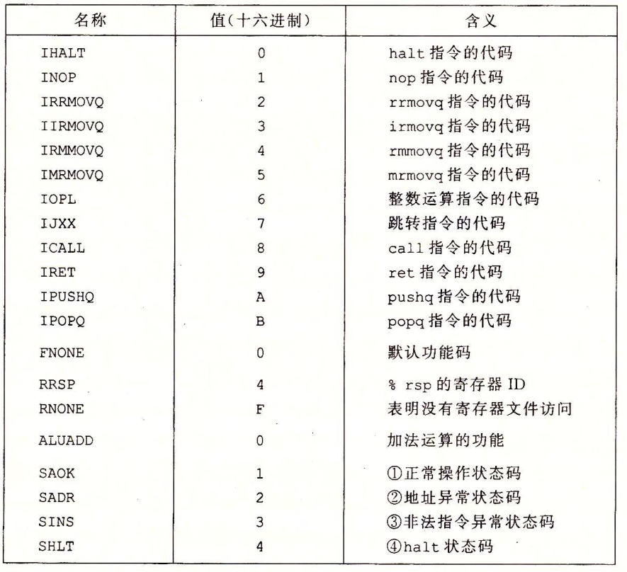
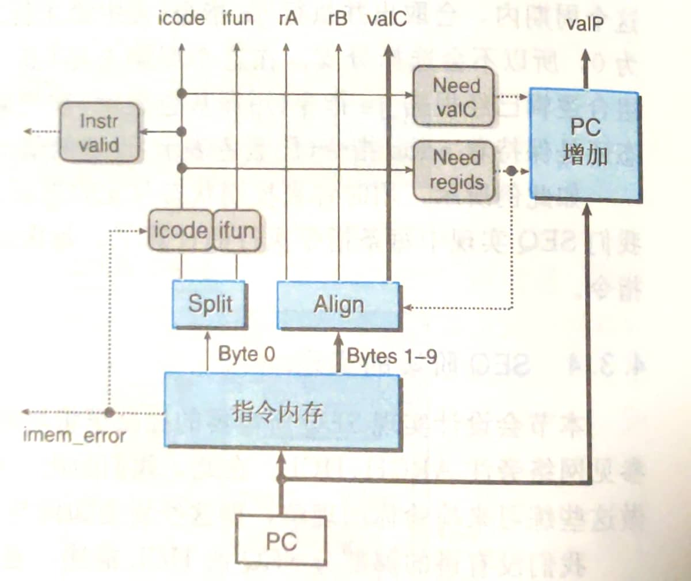
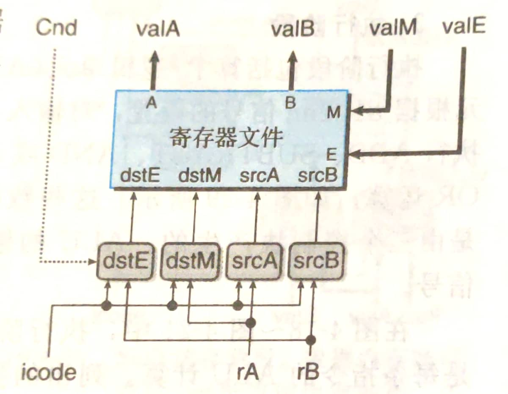
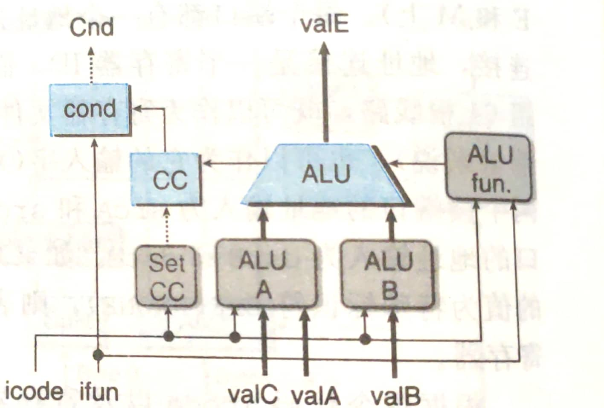
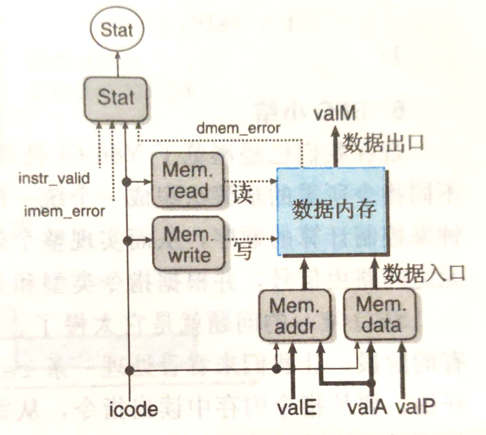
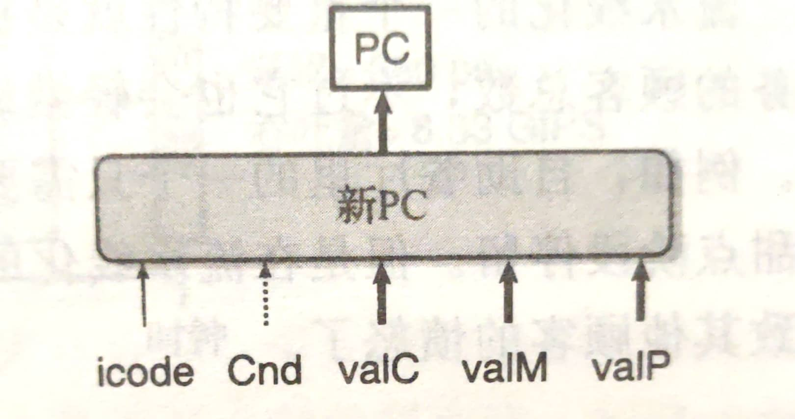

## 流程
- ISA抽象--> 微操作--> 硬件实现
-------
## 抽象视图

-------
## 具体到每个细分结构
- 说明
  1. 蓝色方框为硬件单元（hardware unit），太难了，不关心
  2. 白色方框为时钟寄存器，SEQ中只有PC
  3. 白色圆形是线路的名字
  4. 灰色圆角框是组合逻辑，重点关注
  5. 深线是word（64bit），浅线是字节或半字节（8/4bits），虚线是bool
- 下面只画出各个细分结构的图片，具体组合逻辑的HCL表示，需要到下面的文件查看，该文件来自CSAPP官网，有SEQ，有PIPE
- ./附件/阅读材料/waside-hcl.pdf
-------
## 细分结构

