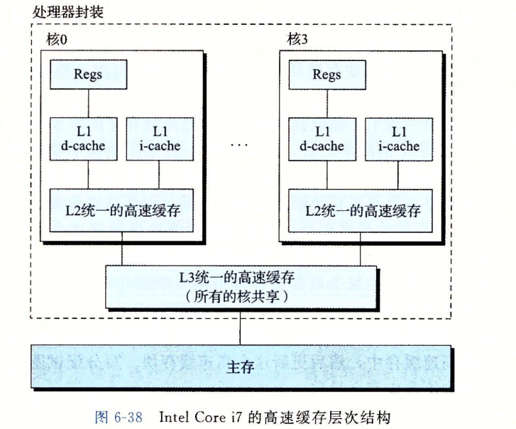

## 一些概念
1. SRAM, DRAM, ROM
2. 存储器金字塔模型等
--------
## 局部性原理
- 概念
    1. 空间局部性：某内存被使用，则其周围在不久将来也有可能被使用
    2. 时间局部性：某内存被使用，则其本身在不久将来可能再次使用
- 程序数据的局部性
  - 较好理解，计算数组和，sum时间局部性，arr空间局部性
- 取指令的局部性
--------
## 高速缓存存储器（重点）
1. 交换单位：block，在现在大多为64位
2. 一些概念
   1. cache hit, cache miss
   2. replace, victim block
   3. cold cache, cold miss: 空缓存，肯定不命中
   4. placement policy: 最灵活的就是随机放（例如数据库实验那个），但找的时候就很麻烦，大多使用的是组相联高速缓存（下面讲）
   5. conflict miss: 冲突了
   6. working set， capacity miss：容量小了，放不下工作集
3. 缓存管理
   1. 编译器管理寄存器文件，L1,L2,L3由内置硬件逻辑管理，DRAM由OS软件+地址翻译硬件管理，还有一些....
4. 地址模型和缓存模型

5. 通用操作
- 组选择->行匹配->字选择->行替换
6. 一些类型
   1. 直接映射高速缓存
   2. 组相联高速缓存
   3. 全相联高速缓存
   4. 直接映射冲突概率大（不用），全相联行匹配时间长（小高速缓存就可以使用），组相联比较好
   5. 行替换（或者称为组内行替换）有LRU，LFU等
7. 写
   1. 写命中（write hit）：直写（write through)和写回(write back，要加脏位)
   2. 写不命中（write miss）：写分配（write allocate），非写分配（not write allocate）
   3. 写回一般配写分配，另外一组也搭配
   4. 越往金字塔下面走，写的代价越高，因此越喜欢用写回
8. 真实情况
- 重点关注
  - i cache, d cache, unified cache
  - 核独占，核共享

9. 补充
   1.  相联度的影响，6说了
   2.  写策略的影响，7说了
   3.  块大小的影响，
       1.  块大，利于空间局部性
       2.  若程序时间局部性好（例如三个变量a，b，c不相邻），那么块大可能不利于它
       3.  块大传送时间长
       4.  目前使用64位作为一个块
10. 还有一些待学习